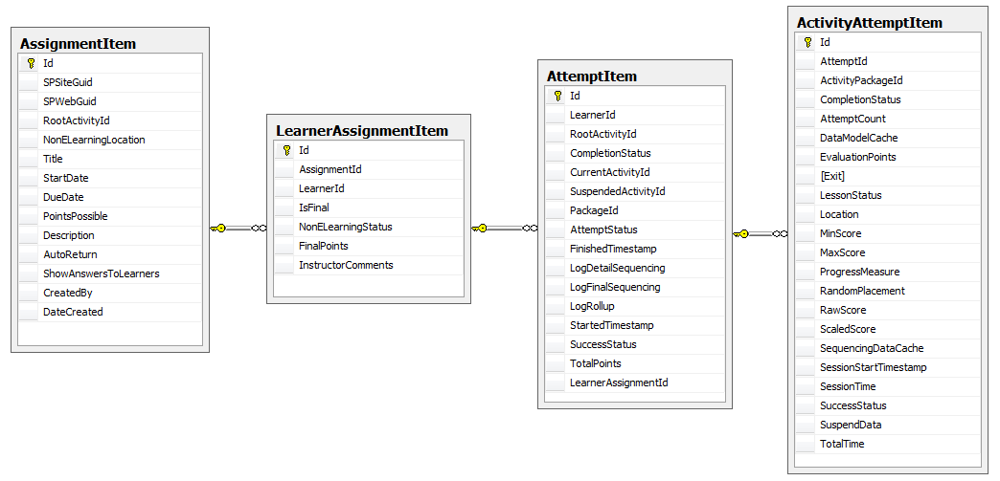
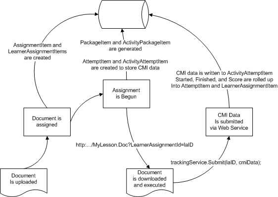

## Overview
SLK allows you to upload and assign two types of content -- eLearning content (e.g. SCORM & Class Server) and non-eLearning content (e.g. Word documents, PowerPoint decks, etc.)  eLearning content supports rich tracking of status, score, dates, and progress through the CMI data model exposed via the JScript RunTimeEnvironment.  non-eLearning content supports Status, Final Points (e.g. score), and Instructor comments only.

There have been many requests to improve SLK's support for assigning non-eLearning content, especially around dates (assigned, started, completed) and submitting results (aka drop box for changed content).  One approach to solving this problem is to enable CMI Tracking for non-eLearning content since the CMI data model already contains much of this information and it is already available in SLK today.

The SQL Schema for creating assignments and storing data about those assignments looks like:

How it works is:

* When an eLearning Action is used from a Document Library to assign a Document, an Assignment Item record is created for that document and a LearnerAssignmentItem record is created for each student -> document pair.
* For eLearning content, when the Assignment is Begun by the student, an AttemptItem record is created for the LearnerAssignmentItem.  For each Activity (there may be more than one) in the eLearning content, a new ActivityAttemptItem is created with the CMI data for that Activity when it is ended.
* For non-eLearning content, when the Assignment is Begun by the student, the LearnerAssignmentItem.NonELearningStatus is set.  The teacher, upon reviewing the completed assignment, can set FinalPoints and Instructor comments.  No AttemptItem or ActivityAttemptItem records are created.  There is no place to store CMI data.

I investigated the possiblity of using the SLK APIs to create AttemptItem and ActivityAttemptItem records for non-eLearning content.  The rough idea was to:

* Pass the LearnerAssignmentId down to the non-eLearning content.
* Create a new Web Service that sits side by side with SLK.  Submit CMI status back to SLK from the non-eLearning content using a call similar to:
	* trackingService.Submit(learnerAssignmentId, cmiData);
* When the web service receives the incoming call, it would call:
	* StoredLearningSession slc = slkStore.StartAttemptOnLearnerAssignment(learnerAssignmentId);
	* slc.CurrentActivityDataModel... = cmiData;

This approach did not work.  There is too much logic in the SLK API for StoredLearningSession which is tightly integrated with the rich data provided by SCORM and Class Server content.  I considered 'hacking' the data so that when non-eLearning content was detected, a minimum of pseudo-data was inserted into the database (like AssignmentItem.RootActivityId = 0) to enable us to trick the SLK API into working with non eLearning content.  Alas, this was not feasible in a clean way that I could see.

So, instead the CMI Tracking Service will wait for an incoming call and when this call comes in, it will directly manipulate the tables AttemptItem and ActivityAttemptItem to insert records associated with the LearnerAssignmentItem for the non-eLearning content.  If they don't already exist, a new PackageItem (with a null manifest and PackageFormat of 'Document') and ActivityPackageItem will be created for the Assignment.  This will allow us to leverage the same database schema without change.  In essence, we will be generating a 'pseudo-SCORM wrapper' for the content upon demand.  Non-eLearning content, because there is no manifest, will always be limited to a single Activity per Package.

## Workflow Diagram

## Security
Since non-eLearning content is not guaranteed to run in a browser, it cannot share the security context in the same way that SCORM and Class Server content can.  Since we want to use REST/POX based web services to allow uploading of the data in order to make it easy to develop CMI data enabled content, we cannot rely upon security mechanisms like Windows Authentication or WS/Security to give us a security context for free.

Most REST/POX based web services use a shared secret token to secure the call.  This takes the form of either a long computer generated token that must be transfered out of band or a token that is distributed on a session by session basis.  With SLK we already have a concept close to the session by session token -- the LearnerAssignmentId.  Unfortunately, today it takes the form of an incrementing long integer which is easy to guess.  A future change to substitute a randomly generated GUID would greatly strengthen the security of this approach, however this change is going to be postponed for now so we can enable this functionality without requiring an expensive schema change.

## High Level Architecture
* LearnerAssignmentId is passed from SLK to content when an assignment is launched via a HTTP parameter (e.g. http://MySLK/Lessons/MyLesson.htm?LearnerAssignmentId=12)
* Windows Communications Foundation based Web Service using WebHttpBinding (e.g. REST/POX) to facilitate maximum interoperability with content
* System.Runtime.Serialization DataContracts will represent the CMI data to make it simple to create/consume via C# while also being compatible with simple XML parsing 

## Associated Work Items
[workitem:14439](workitem_14439)
[workitem:14440](workitem_14440)
[workitem:14467](workitem_14467)