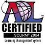

 SharePoint Learning Kit is a SCORM 2004 certified e-learning delivery and tracking application built as a SharePoint solution. It works with SharePoint 2013, SharePoint 2010, and Windows SharePoint Services 3.0 or Microsoft Office SharePoint Server 2007. It has the following core features:

* Supports SCORM 1.2, SCORM 2004, and Class Server content, allowing users to store and manage this content in SharePoint document libraries.
* Supports learner-centric and instructor-led (assigned) workflows.
* Allows assignment, tracking and grading of both e-learning and non-e-learning content.

### Announcements / Requests
* SLK 1.7 is now released at [release:118385](release_118385)
* SLK version 1.7 Beta now available at [release:114601](release_114601). Lots of new features, but main one is SharePoint 2013 support.
* SLK version 1.6 Beta now available at [release:75705](release_75705). Main features are email support, text based grades and assignments without a document.
* SLK version 1.5 now available at [release:60708](release_60708). Main feature is support for SharePoint 2010.
* SLK version 1.4+ has been delivered. Available at [release:38555](release_38555). Main features are integrated Drop Box for non-Scorm content, Firefox support and teacher review mode.
* Development build SLK-1.3.2-20090220 - Remove the requirement for Session State unless actually using the Observer role. [release:23487](release_23487)
* I've added a new development release at [release:23487](release_23487). This will contain a build after every significant functional addition.
* I've now promoted 1.3.1RC to the official latest release [release:9206](release_9206)
* Richard Willis of SalamanderSoft has accepted the role of coordinator on this SLK project
* The SLK Course Manager is now available for [release:9206](release_9206).  Course Manager is an add-on that provides course planning, assignment tracking, and grade book.
* LanguagePack 1.1 containing 29 languages has been added to [release:9206](release_9206). Thanks to all the localization owners for their contribution and effort.
* A preview release of the Assignment Dropbox by Drooke is available on the [release:8691](release_8691) page.
* If any budding author is interested in creating a cohesive article on SCORM authoring tools out of the forum thread on this same topic, we can post it to these web pages.  Unaffiliated user reviews of the tools mentioned are encouraged.
* If you can provide sample content to be used in testing SLK which can be included in the SLK source code, please see the [forums post on this topic](https://www.codeplex.com/Thread/View.aspx?ProjectName=SLK&ThreadId=19765).  Content created by various SCORM authoring tools is highly sought after.

### Frequently Asked Questions
If you have questions about SLK, check out the [SLK FAQ](SLK-FAQ) and project forums. 

##### For the user
* [How To Test a Patch](Test-a-Patch) : Eager to take a look at work in progress or help get a bug or feature checked in?  Help out by offering to help test someone's work.

##### For the developer
* [Checking In](Checking-In) : How do I submit a bugfix or new feature for consideration?
* [Community Roles](Community-Roles) : How do you get checkin rights for SLK? Who decides what goes into SLK and what stays out?

##### Localization Related
* [HowToCheckInTranslationXMLFiles](HowToCheckInTranslationXMLFiles) : How do I help localize SLK?

### Build your own SLK Demo

[Download & Install Virtual PC 2007](http://www.microsoft.com/downloads/details.aspx?FamilyId=04D26402-3199-48A3-AFA2-2DC0B40A73B6&displaylang=en)
[Download & Run Windows Server 2003 R2 VPC Image](http://www.microsoft.com/downloads/details.aspx?familyid=77f24c9d-b4b8-4f73-99e3-c66f80e415b6&displaylang=en)
[Download & Install SQL Server 2005 Express in the VPC](http://go.microsoft.com/fwlink/?linkid=65212)
[Download & Install SLK in the VPC](https://www.codeplex.com/Release/ProjectReleases.aspx?ProjectName=SLK)

### [New Feature Documentation](New-Feature-Documentation)